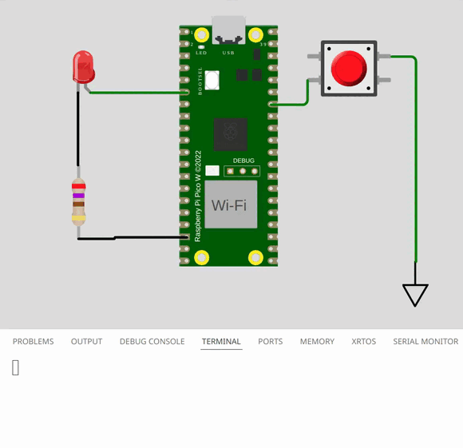

# exe 5

> [!TIP]
> Você vai precisar usar tanto a borda de subida quando de descida. Desenhe no papel para tentar entender como!

O desafio é reconhecer quando o usuário aperta o botão rapidamente e quando ele executa um aperto mais longo (mais que `800ms`). Ao detectar um aperto curto imprimir a mensagem:

- `printf("Aperto curto!\n");`

E ao detectar um aperto longo, imprimir:

- `printf("Aperto longo!\n");`

> [!WARNING]
> Nesse exercício você não pode fazer uso da func. `gpio_get`, deve conseguir resolver apenas com o uso de interrupção. 
>
> Verificamos isso automaticamente no seu repositório do github!